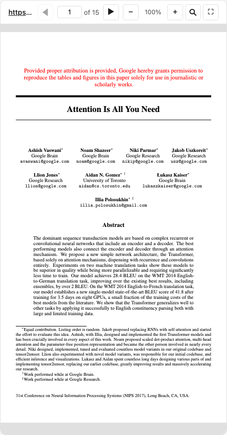

# PDF Server



An interactive PDF viewer using [PDF.js](https://mozilla.github.io/pdf.js/). Supports local files and remote URLs from academic sources (arxiv, biorxiv, zenodo, etc).

## MCP Client Configuration

Add to your MCP client configuration (stdio transport):

```json
{
  "mcpServers": {
    "pdf": {
      "command": "npx",
      "args": [
        "-y",
        "--silent",
        "--registry=https://registry.npmjs.org/",
        "@modelcontextprotocol/server-pdf",
        "--stdio"
      ]
    }
  }
}
```

### Local Development

To test local modifications, use this configuration (replace `~/code/ext-apps` with your clone path):

```json
{
  "mcpServers": {
    "pdf": {
      "command": "bash",
      "args": [
        "-c",
        "cd ~/code/ext-apps/examples/pdf-server && npm run build >&2 && node dist/index.js --stdio"
      ]
    }
  }
}
```

## What This Example Demonstrates

### 1. Chunked Data Through Size-Limited Tool Calls

On some host platforms, tool calls have size limits, so large PDFs cannot be sent in a single response. This example streams PDFs in chunks using HTTP Range requests:

**Server side** (`server.ts`):

```typescript
// Returns chunks with pagination metadata
{
  (bytes, offset, byteCount, totalBytes, hasMore);
}
```

**Client side** (`mcp-app.ts`):

```typescript
// Load in chunks with progress
while (hasMore) {
  const chunk = await app.callServerTool({
    name: "read_pdf_bytes",
    arguments: { url, offset },
  });
  chunks.push(base64ToBytes(chunk.bytes));
  offset += chunk.byteCount;
  hasMore = chunk.hasMore;
  updateProgress(offset, chunk.totalBytes);
}
```

### 2. Model Context Updates

The viewer keeps the model informed about what the user is seeing:

```typescript
app.updateModelContext({
  content: [
    {
      type: "text",
      text: `PDF viewer | "${title}" | Current Page: ${page}/${total}\n\nPage content:\n${pageText}`,
    },
  ],
});
```

This enables the model to answer questions about the current page or selected text.

### 3. Display Modes: Fullscreen vs Inline

- **Inline mode**: App requests height changes to fit content
- **Fullscreen mode**: App fills the screen with internal scrolling

```typescript
// Request fullscreen
app.requestDisplayMode({ mode: "fullscreen" });

// Listen for mode changes
app.ondisplaymodechange = (mode) => {
  if (mode === "fullscreen") enableScrolling();
  else disableScrolling();
};
```

### 4. External Links (openLink)

The viewer demonstrates opening external links (e.g., to the original arxiv page):

```typescript
titleEl.onclick = () => app.openLink(sourceUrl);
```

### 5. View Persistence

Page position is saved per-view using `viewUUID` and localStorage.

### 6. Dark Mode / Theming

The viewer syncs with the host's theme using CSS `light-dark()` and the SDK's theming APIs:

```typescript
app.onhostcontextchanged = (ctx) => {
  if (ctx.theme) applyDocumentTheme(ctx.theme);
  if (ctx.styles?.variables) applyHostStyleVariables(ctx.styles.variables);
};
```

## Usage

```bash
# Default: loads a sample arxiv paper
bun examples/pdf-server/main.ts

# Load local files (converted to file:// URLs)
bun examples/pdf-server/main.ts ./docs/paper.pdf /path/to/thesis.pdf

# Load from URLs
bun examples/pdf-server/main.ts https://arxiv.org/pdf/2401.00001.pdf

# Mix local and remote
bun examples/pdf-server/main.ts ./local.pdf https://arxiv.org/pdf/2401.00001.pdf

# stdio mode for MCP clients
bun examples/pdf-server/main.ts --stdio ./papers/
```

## Security: Client Roots

MCP clients may advertise **roots** — `file://` URIs pointing to directories on the client's file system. The server uses these to allow access to local files under those directories.

- **Stdio mode** (`--stdio`): Client roots are **always enabled** — the client is typically on the same machine (e.g. Claude Desktop), so the roots are safe.
- **HTTP mode** (default): Client roots are **ignored** by default — the client may be remote, and its roots would be resolved against the server's filesystem. To opt in, pass `--use-client-roots`:

```bash
# Trust that the HTTP client is local and its roots are safe
bun examples/pdf-server/main.ts --use-client-roots
```

When roots are ignored the server logs:

```
[pdf-server] Client roots are ignored (default for remote transports). Pass --use-client-roots to allow the client to expose local directories.
```

## Allowed Sources

- **Local files**: Must be passed as CLI arguments (or via client roots when enabled)
- **Remote URLs**: arxiv.org, biorxiv.org, medrxiv.org, chemrxiv.org, zenodo.org, osf.io, hal.science, ssrn.com, and more

## Tools

| Tool             | Visibility | Purpose                                               |
| ---------------- | ---------- | ----------------------------------------------------- |
| `list_pdfs`      | Model      | List available local files and origins                |
| `display_pdf`    | Model + UI | Display interactive viewer                            |
| `interact`       | Model      | Navigate, annotate, search, extract pages, fill forms |
| `read_pdf_bytes` | App only   | Stream PDF data in chunks                             |
| `save_pdf`       | App only   | Save annotated PDF back to local file                 |

## Example Prompts

After the model calls `display_pdf`, it receives the `viewUUID` and a description of all capabilities. Here are example prompts and follow-ups that exercise annotation features:

### Annotating

> **User:** Show me the Attention Is All You Need paper
>
> _Model calls `display_pdf` → viewer opens_
>
> **User:** Highlight the title and add an APPROVED stamp on the first page.
>
> _Model calls `interact` with `highlight_text` for the title and `add_annotations` with a stamp_

> **User:** Can you annotate this PDF? Mark important sections for me.
>
> _Model calls `interact` with `get_pages` to read content first, then `add_annotations` with highlights/notes_

> **User:** Add a note on page 1 saying "Key contribution" at position (200, 500), and highlight the abstract.
>
> _Model calls `interact` with `add_annotations` containing a `note` and either `highlight_text` or a `highlight` annotation_

### Navigation & Search

> **User:** Search for "self-attention" in the paper.
>
> _Model calls `interact` with action `search`, query `"self-attention"`_

> **User:** Go to page 5.
>
> _Model calls `interact` with action `navigate`, page `5`_

### Page Extraction

> **User:** Give me the text of pages 1–3.
>
> _Model calls `interact` with action `get_pages`, intervals `[{start:1, end:3}]`, getText `true`_

> **User:** Take a screenshot of the first page.
>
> _Model calls `interact` with action `get_pages`, intervals `[{start:1, end:1}]`, getScreenshots `true`_

### Stamps & Form Filling

> **User:** Stamp this document as CONFIDENTIAL on every page.
>
> _Model calls `interact` with `add_annotations` containing `stamp` annotations on each page_

> **User:** Fill in the "Name" field with "Alice" and "Date" with "2026-02-26".
>
> _Model calls `interact` with action `fill_form`, fields `[{name:"Name", value:"Alice"}, {name:"Date", value:"2026-02-26"}]`_

## Testing

### E2E Tests (Playwright)

```bash
# Run annotation E2E tests (renders annotations in a real browser)
npx playwright test tests/e2e/pdf-annotations.spec.ts

# Run all PDF server tests
npx playwright test -g "PDF Server"
```

### API Prompt Discovery Tests

These tests verify that Claude can discover and use annotation capabilities by calling the Anthropic Messages API with the tool schemas. They are **disabled by default** — skipped unless `ANTHROPIC_API_KEY` is set:

```bash
ANTHROPIC_API_KEY=sk-ant-... npx playwright test tests/e2e/pdf-annotations-api.spec.ts
```

The API tests simulate a conversation where `display_pdf` has already been called, then send a follow-up user message and verify the model uses annotation actions (or at least the `interact` tool). Three scenarios are tested:

| Scenario             | User prompt                                                       | Expected model behavior                    |
| -------------------- | ----------------------------------------------------------------- | ------------------------------------------ |
| Direct annotation    | "Highlight the title and add an APPROVED stamp"                   | Uses `highlight_text` or `add_annotations` |
| Capability discovery | "Can you annotate this PDF?"                                      | Uses interact or mentions annotations      |
| Specific notes       | "Add a note saying 'Key contribution' and highlight the abstract" | Uses `interact` tool                       |

## Architecture

```
server.ts                  # MCP server + tools
main.ts                    # CLI entry point
src/
├── mcp-app.ts             # Interactive viewer UI (PDF.js)
├── pdf-annotations.ts     # Annotation types, diff model, PDF import/export
└── pdf-annotations.test.ts # Unit tests for annotation module
```

## Key Patterns Shown

| Pattern                       | Implementation                                                 |
| ----------------------------- | -------------------------------------------------------------- |
| App-only tools                | `_meta: { ui: { visibility: ["app"] } }`                       |
| Chunked responses             | `hasMore` + `offset` pagination                                |
| Model context                 | `app.updateModelContext()`                                     |
| Display modes                 | `app.requestDisplayMode()`                                     |
| External links                | `app.openLink()`                                               |
| View persistence              | `viewUUID` + localStorage                                      |
| Theming                       | `applyDocumentTheme()` + CSS `light-dark()`                    |
| Annotations                   | DOM overlays synced with proper PDF annotation dicts           |
| Annotation import             | Load existing PDF annotations via PDF.js `getAnnotations()`    |
| Diff-based persistence        | localStorage stores only additions/removals vs PDF baseline    |
| Proper PDF export             | pdf-lib low-level API creates real `/Type /Annot` dictionaries |
| Save to file                  | App-only `save_pdf` tool writes annotated bytes back to disk   |
| Dirty flag                    | `*` prefix on title when unsaved local changes exist           |
| Command queue                 | Server enqueues → client polls + processes                     |
| File download                 | `app.downloadFile()` for annotated PDF                         |
| Floating panel with anchoring | Magnetic corner-snapping panel for annotation list             |
| Drag, resize, rotate          | Interactive annotation handles with undo/redo                  |
| Keyboard shortcuts            | Ctrl+Z/Y (undo/redo), Ctrl+S (save), Ctrl+F (search), ⌘Enter   |

### Annotation Types

Supported annotation types (synced with PDF.js):

| Type            | Properties                                  | PDF Subtype  |
| --------------- | ------------------------------------------- | ------------ |
| `highlight`     | `rects`, `color?`, `content?`               | `/Highlight` |
| `underline`     | `rects`, `color?`                           | `/Underline` |
| `strikethrough` | `rects`, `color?`                           | `/StrikeOut` |
| `note`          | `x`, `y`, `content`, `color?`               | `/Text`      |
| `rectangle`     | `x`, `y`, `width`, `height`, `color?`, etc. | `/Square`    |
| `circle`        | `x`, `y`, `width`, `height`, `color?`, etc. | `/Circle`    |
| `line`          | `x1`, `y1`, `x2`, `y2`, `color?`            | `/Line`      |
| `freetext`      | `x`, `y`, `content`, `fontSize?`, `color?`  | `/FreeText`  |
| `stamp`         | `x`, `y`, `label`, `color?`, `rotation?`    | `/Stamp`     |

## Dependencies

- `pdfjs-dist`: PDF rendering and annotation import (frontend only)
- `pdf-lib`: Client-side PDF modification — creates proper PDF annotation dictionaries for export
- `@modelcontextprotocol/ext-apps`: MCP Apps SDK
